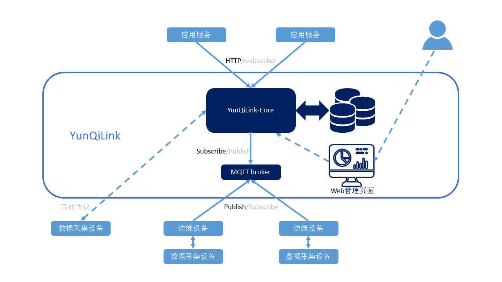

# YunQiLink平台

YunQiLink是云栖智造工业物联网平台。按照部署形式，有两种版本：

- 公有云版本

云栖智造公有云的组成部分，部署在云栖智造的服务器上，具备所有功能。

- 私有云版本

云栖智造企业版的组成部分，部署在企业客户的服务器上，根据需要裁减掉部分功能。

## 系统设计



YunQiLink作为云栖智造的物联网平台，南向对接数据采集设备，收集数据。对收集的数据进行汇聚和归集，提供基本的查询手段和分析结果。北向对接各种应用服务，为应用服务提供接口访问这些分析结果。

YunQiLink包括以下组成部分

1. MQTT broker
2. 时序数据库
3. YunQiLink核心服务程序
4. Web管理页面

### MQTT broker

选择Moquette 0.12 [说明文档](https://moquette-io.github.io/moquette/documentation.html)

为支持之前的数据采集功能，设备上传采用Publish，topic为

```
"/sys/${productKey}/${deviceName}/thing/event/property/post"
```

payload格式示例如下：

```js
{
  "messageInfo":{
    "collectTime":"2020-05-14 23:27:49",
    "edgeSN":"JKFKBV2"
  },
  "params":{
    "status":1,
    "count":1000,
    "speed":120.50,
    "workOrder":"broa20201021001"
    ......
  }
}
```

messageInfo包含此次上报的时间和边缘设备SN。
params包含设备状态，状态字段的值有两种类型，数值类型和字符串类型。如果布尔型，设备端会转成0或1。
这些状态字段并没有事先定义，YunQiLink可能直到收到上报Publish的内容才直到某个状态字段的存在。

### 时序数据库

选择TDengine

数据库设计要求如下：
因为单台设备数据量非常庞大，所以重点是读写性能，要充分利用TDengine自带的缓存功能，提高读写性能。
采用一机一表，每台设备在数据库中采用独立的一张表存储数据记录。
对所有状态字段在表中创建独立的列，方便利用TDengine的自带功能进行最大值，最小值，平均值的高效运算。

### YunQiLink核心服务程序

完成YunQiLink的主体功能。

采用Java开发。
阿里的编码规范。

### Web管理界面

提供通用的Web管理界面，满足无特殊要求的工业互联网项目的后台管理需求。

## API接口

### 名词解释

- **domain**: 数采服务器地址，具体项目确定
- **pk**: Product Key。产品识别字符串，用来区分设备类型，不通类型产品pk不同，由字母，数字，'_', '-'组成
- **did**: Device ID。设备识别符，同一pk下的不同设备did不同，由字母，数字，'_', '-'组成。
- **appid**: Application ID。应用识别符，用来区分不同的应用程序，手机APP，微信小程序，其他平台等等，由字母，数字，`'_'`, '-'组成。
- **info**: 设备在绑定时，由YunQiLink附加在设备上的信息，如别名，备注，其他附加信息等，设备端并不同步存储info
- **status**: 设备的状态，由设备自身上报，用来指示设备的一些状态或配置信息，如转速、开关等，YunQiLink无法修改设备的status


## 嘉顺项目不包含功能

嘉顺项目为私有云版本，是简化版本，裁减掉以下功能：

- appid。不区分各种应用，需要携带appid的地方，均忽略。
- 用户。不区分用户，省略注册，登录等，需要携带用户token的地方，均忽略
- 设备身份识别。不进行设备身份识别，所有设备上传上来数据均为有效数据
- 绑定。不支持绑定，因为没有用户，接口访问的对象是所有设备
- info。不支持绑定信息，因为没有绑定过程，所以暂时没有alias，remark等绑定信息，应用平台暂时自行管理这些

### API列表

Method | URI | 描述
----|---|---
GET | {domain}/devices                   | 获取设备列表
GET | {domain}/device/{pk}/{did}         | 获取指定设备实时值
GET | {domain}/device/{pk}/{did}/history | 获取指定设备历史值
GET | {domain}/device/{pk}/{did}/max     | 获取指定设备最大值
GET | {domain}/device/{pk}/{did}/min     | 获取指定设备最小值
GET | {domain}/device/{pk}/{did}/avg     | 获取指定设备平均值
GET | {domain}/device/{pk}/{did}/diff    | 获取指定设备差值

### 绑定设备

为此用户绑定具体设备，必须提供pk和did参数，二者结合是全局唯一。

请求地址及方式

    POST
    {domain}/devices

请求参数

参数|类型|必填|参数类型|描述
----|----|----|--------|----
Application-Id | string  | 是 | header| appid。*嘉顺暂时不实现*
Authorization  | string  | 是 | header| 用户token。*嘉顺暂时不实现*
Timestamp      | string  | 是  | header| 请求时间戳，与服务器相差不能超过 5 分钟。*嘉顺暂时不实现*
Signature      | string  | 是  | header| 签名，计算方法为 lower(md5(ps + Timestamp))。*嘉顺暂时不实现*
pk             | string  | 是 | body  | 设备的pk
did            | string  | 是 | body  | 设备ID
info           | object  | 否 | body  | 设备的绑定信息
info._alias    | string  | 否 | body  | 设备别名
info._remark   | string  | 否 | body  | 设备备注
schema         | array   | 是 | body  | 设备模型
schema.column  | string  | 是 | body  | 设备上传的status字段名
schema.type    | string  | 是 | body  | 设备上传的status字段类型

响应参数

参数|类型|描述
----|----|----
device                  | array   | 绑定的设备列表
device.did              | string  | 设备ID
device.pk               | string  | 产品Product Key
device.info             | object  | 设备的绑定信息
device.info._alias      | string  | 设备别名
device.info._remark     | string  | 设备备注

- 示例一

获取所有设备的实时数据

请求

```js
POST: {domain}/devices
Content-Type:application/json
Body:
{
  "did":"rzRe65wvKLlw4R1EV0KLHrYo8bObQzab",
  "pk":"0361d124dabd4996",
  "info":{
    "_alias":"二车间5号",
    "_remark":"TOSHIBA-200数控机床，2005年引进",
  },
  "schema": [
    {"column":"status", "type":"int(2)"},
    {"column":"address", "type": "nchar(255)"},
    ...
  ]
}
```

回复

```js
Response-Code: 200
Body:
{
  device:{
    "did":"rzRe65wvKLlw4R1EV0KLHrYo8bObQzab",
    "pk":"0361d124dabd4996",
    "info":{
      "_alias":"二车间5号",
      "_remark":"TOSHIBA-200数控机床，2005年引进",
    }
  }
}
```

### 解绑设备

请求地址及方式

    DELETE
    {domain}/device/{pk}/{did}

请求参数

参数|类型|必填|参数类型|描述
----|----|----|--------|----
Application-Id | string  | 是 | header| appid。*嘉顺暂时不实现*
Authorization  | string  | 是 | header| 用户token。*嘉顺暂时不实现*
pk             | string  | 是 | path  | 指定设备的pk
did            | string  | 是 | path  | 指定设备的did

响应参数

无


### 获取设备列表

获取此用户下所有产品的绑定设备列表。如果需要对多个产品有筛选，依据对appid的判断。
如果需要获取指定产品的设备列表，需要使用pk参数。

请求地址及方式

    GET
    {domain}/devices

请求参数

参数|类型|必填|参数类型|描述
----|----|----|--------|----
Application-Id | string  | 是 | header| appid。*嘉顺暂时不实现*
Authorization  | string  | 是 | header| 用户token。*嘉顺暂时不实现*
limit          | integer | 否 | query | 返回的结果条数，默认20
skip           | integer | 否 | query | 表示跳过的条数，间接表示页数，默认0
filter         | object  | 否 | body  | 过滤器设置
filter.exclude | boolean | 否 | body  | include或exclude，默认include
filter.pks     | array   | 否 | body  | 指定pk的设备
filter.dids    | array   | 否 | body  | 指定did的设备
filter.online  | boolean | 否 | body  | 上线离线状态，默认为不关心，显示的true和false表示只关心在线或离线的设备

响应参数

参数|类型|描述
----|----|----
devices                 | array   | 绑定的设备列表
device.did              | string  | 设备ID
device.pk               | string  | 产品Product Key
device.info             | object  | 设备的绑定信息
device.info._alias      | string  | 设备别名
device.info._remark     | string  | 设备备注
device.online           | boolean | 设备是否在线
device.status           | object  | 设备最新一次上报的状态
device.status._reportat | integer | 设备最新一次上报的时间戳
device.status._edge     | string  | 设备最新一次上报所经的边缘设备ID，如果直接上报则为空
device.status.xxxxx     | string  | 设备最新一次上报的其他状态值


- 示例一

获取所有设备的实时数据

请求

```
GET: {domain}/devices
Content-Type:application/json
Body:none
```

回复

```js
Response-Code: 200
Body:
{
  devices:[
    {
      "did":"rzRe65wvKLlw4R1EV0KLHrYo8bObQzab",
      "pk":"0361d124dabd4996",
      "info":{
        "_alias":"二车间5号",
        "_remark":"TOSHIBA-200数控机床，2005年引进",
      },
      "online":true,
      "status":{
        "_reportat":1601426650,
        "_edge":"JKFKBV2",
        "status":1,
        "count":1000,
        "speed":120.50,
        "workOrder":"broa20201021001"
      }
    },
    ...（从第一个开始，最多20个）
  ]
}
```


- 示例二

获取所有设备的实时数据(分页)

请求

```
GET: {domain}/devices?skip=15&limit=50
Content-Type:application/json
Body:none
```

回复

同示例一，不过返回从第16个开始，到第65个设备的列表

- 示例三

获取指定设备列表的实时数据

请求

```js
GET: {domain}/devices
Content-Type:application/json
Body:
{
  filter:{
    "dids":[
      "rzRe65wvKLlw4R1EV0KLHrYo8bObQzab",
      "LdMt3aIt4TTkPZDmlDIxYlS1jqMv8p3Q"
    ]
  }
}
```

回复

同示例一，不过只有指定设备的内容

### 获取指定设备实时值

获取指定设备状态。

请求地址及方式

    GET
    {domain}/device/{pk}/{did}

请求参数

参数|类型|必填|参数类型|描述
----|----|----|--------|----
Application-Id | string  | 是 | header| appid。*嘉顺暂时不实现*
Authorization  | string  | 是 | header| 用户token。*嘉顺暂时不实现*
pk             | string  | 是 | path  | 指定设备的pk
did            | string  | 是 | path  | 指定设备的did

响应参数

参数|类型|描述
----|----|----
device                  | array   | 绑定的设备列表
device.did              | string  | 设备ID
device.pk               | string  | 产品Product Key
device.info             | object  | 设备的绑定信息
device.info._alias      | string  | 设备别名
device.info._remark     | string  | 设备备注
device.online           | boolean | 设备是否在线
device.status           | object  | 设备最新一次上报的所有状态值
device.status._reportat | integer | 设备最新一次上报的时间戳
device.status._edge     | string  | 设备最新一次上报所经的边缘设备ID，如果直接上报则为空
device.status.xxxxx     | string  | 设备最新一次上报的其他状态值

- 示例一

获取指定设备的状态

请求

```
GET: {domain}/device/0361d124dabd4996/rzRe65wvKLlw4R1EV0KLHrYo8bObQzab
Content-Type:application/json
Body:none
```

回复

```js
Response-Code: 200
Body:
{
  device:{
    "did":"rzRe65wvKLlw4R1EV0KLHrYo8bObQzab",
    "pk":"0361d124dabd4996",
    "info":{
      "_alias":"二车间5号",
      "_remark":"TOSHIBA-200数控机床，2005年引进",
    },
    "online":true,
    "status":{
      "_reportat":1601426650,
      "_edge":"JKFKBV2",
      "status":1,
      "count":1000,
      "speed":120.50,
      "workOrder":"broa20201021001"
    }
  }
}
```


### 获取指定设备历史值

获取指定设备状态的历史值。

请求地址及方式

    GET
    {domain}/device/{pk}/{did}/history

请求参数

参数|类型|必填|参数类型|描述
----|----|----|--------|----
Application-Id | string  | 是 | header| appid。*嘉顺暂时不实现*
Authorization  | string  | 是 | header| 用户token。*嘉顺暂时不实现*
pk             | string  | 是 | path  | 指定设备的pk
did            | string  | 是 | path  | 指定设备的did
from           | integer | 否 | query | 从什么时间开始的时间戳，默认0
to             | integer | 否 | query | 到什么时间结束的时间戳，默认当前时间戳
reverse        | boolean | 否 | query | 是否倒序，默认正序，正序为从新到旧，倒序为从旧到新
limit          | integer | 否 | query | 返回的结果条数，默认20
skip           | integer | 否 | query | 表示跳过的条数，间接表示页数，默认0

响应参数

参数|类型|描述
----|----|----
device               | array   | 绑定的设备列表
device.did           | string  | 设备ID
device.pk            | string  | 产品Product Key
device.info          | object  | 设备的绑定信息
device.info._alias   | string  | 设备别名
device.info._remark  | string  | 设备备注
device.online        | boolean | 设备是否在线
results              | array   | 历史记录
result._reportat     | integer | 单条历史记录的上报时间戳
result._edge         | string  | 单条历史记录的边缘设备ID，如果直接上报则为空
result.xxxxx         | object  | 单条历史记录的其他状态值
  

- 示例一

获取指定设备的状态的历史值

请求

```
GET: {domain}/device/0361d124dabd4996/rzRe65wvKLlw4R1EV0KLHrYo8bObQzab/history?from=1601410000&to=1601427000
Content-Type:application/json
Body:none
```

回复

```js
Response-Code: 200
Body:
{
  device:{
    "did":"rzRe65wvKLlw4R1EV0KLHrYo8bObQzab",
    "pk":"0361d124dabd4996",
    "info":{
      "_alias":"二车间5号",
      "_remark":"TOSHIBA-200数控机床，2005年引进",
    },
    "online":true
  },
  "results":[
    {
      "_reportat":1601426650,
      "_edge":"JKFKBV2",
      "status":1,
      "count":1000,
      "speed":120.50,
      "workOrder":"broa20201021001"
    },
    ...(按照时间从新到旧排列)
    {
      "_reportat":1601416620,
      "_edge":"JKFKBV2",
      "status":1,
      "count":1000,
      "speed":120.50,
      "workOrder":"broa20201021001"
    }
  ]
}
```


### 获取指定设备最大值/最小值/平均值/差值

获取指定设备状态的最大值/最小值/平均值/差值。

请求地址及方式

    GET
    {domain}/device/{pk}/{did}/max
    {domain}/device/{pk}/{did}/min
    {domain}/device/{pk}/{did}/avg
    {domain}/device/{pk}/{did}/diff

请求参数

参数|类型|必填|参数类型|描述
----|----|----|--------|----
Application-Id | string  | 是 | header| appid。*嘉顺暂时不实现*
Authorization  | string  | 是 | header| 用户token。*嘉顺暂时不实现*
pk             | string  | 是 | path  | 指定设备的pk
did            | string  | 是 | path  | 指定设备的did
from           | integer | 否 | query | 从什么时间开始的时间戳，默认0
to             | integer | 否 | query | 到什么时间结束的时间戳，默认当前时间戳
reverse        | boolean | 否 | query | 是否倒序，默认正序，正序为从新到旧，倒序为从旧到新
limit          | integer | 否 | query | 返回的结果条数，默认20
skip           | integer | 否 | query | 表示跳过的条数，间接表示页数，默认0

响应参数

参数|类型|描述
----|----|----
device               | array   | 绑定的设备列表
device.did           | string  | 设备ID
device.pk            | string  | 产品Product Key
device.info          | object  | 设备的绑定信息
device.info._alias   | string  | 设备别名
device.info._remark  | string  | 设备备注
device.online        | boolean | 设备是否在线
result               | object  | 输出结果
result.xxxxx         | object  | 输出结果的其他状态值（仅限数值型）
  
- 示例一

获取指定设备在指定时间段的状态的平均值

请求

```
GET: {domain}/device/0361d124dabd4996/rzRe65wvKLlw4R1EV0KLHrYo8bObQzab/avg?from=1601410000&to=1601427000
Content-Type:application/json
Body:none
```

回复

```js
Response-Code: 200
Body:
{
  device:{
    "did":"rzRe65wvKLlw4R1EV0KLHrYo8bObQzab",
    "pk":"0361d124dabd4996",
    "info":{
      "_alias":"二车间5号",
      "_remark":"TOSHIBA-200数控机床，2005年引进",
    },
    "online":true
  },
  "result":{
    "status":1,
    "count":1000,
    "speed":120.50,
  }
}
```


